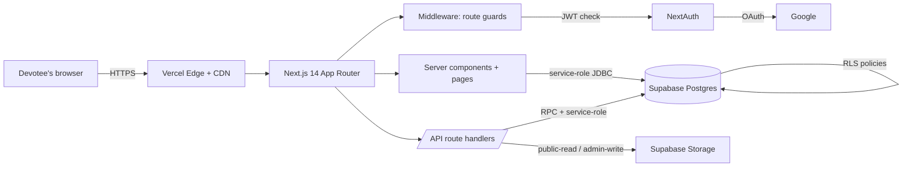
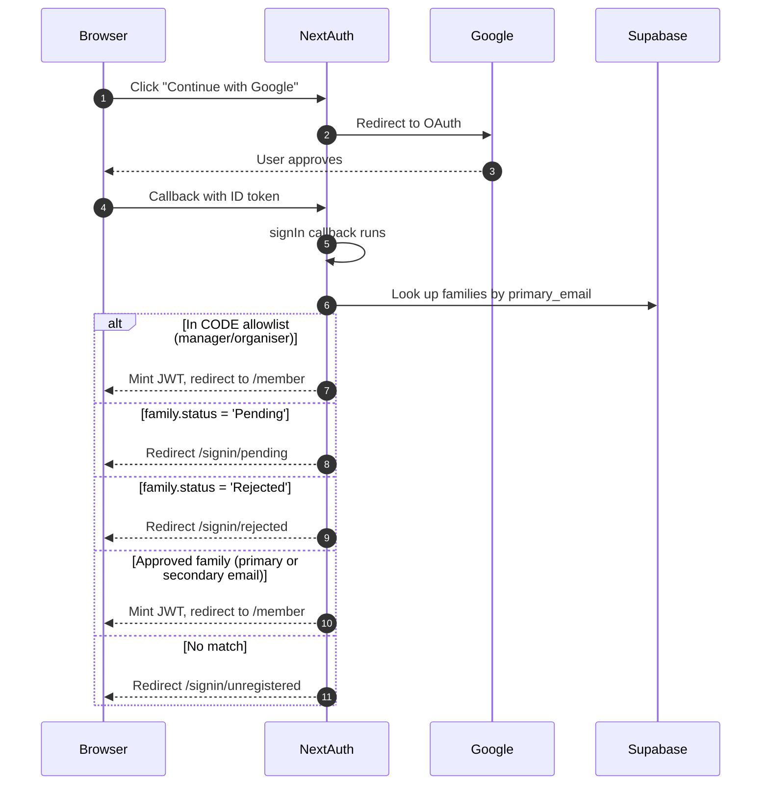

# Bhakti Vriksha Radha Madan Mohan — Website

Next.js 14 website for the **Sunday Bhakti Vriksha program** at Kalkere, Bengaluru. Public marketing pages, a member portal with Google sign-in, per-family attendance, an organiser approval queue, and a Supabase-backed photo gallery.

- 🌐 **Production:** https://bhakti-vriksha.vercel.app
- 🧪 **Dev preview:** https://anchaliitkgp-bhakti-vriksha-site-git-dev-anchal-nema-s-projects.vercel.app
- 📖 **Source of truth:** this repo (`anchaliitkgp/bhakti-vriksha-site`)

---

## Table of contents

1. [Architecture overview](#1-architecture-overview)
2. [Tech stack at a glance](#2-tech-stack-at-a-glance)
3. [Rendering strategies (Next.js)](#3-rendering-strategies-nextjs)
4. [Authentication & authorization](#4-authentication--authorization)
5. [Data model](#5-data-model)
6. [Key database patterns](#6-key-database-patterns)
7. [Storage & gallery pipeline](#7-storage--gallery-pipeline)
8. [Environments (local → dev → prod)](#8-environments-local--dev--prod)
9. [Local development](#9-local-development)
10. [Common operations](#10-common-operations)
11. [Environment variables](#11-environment-variables)
12. [Deployment](#12-deployment)
13. [Project structure](#13-project-structure)
14. [Further reading](#14-further-reading)

---

## 1. Architecture overview



One Next.js 14 application deployed to Vercel, one Postgres database on Supabase, Google sign-in through NextAuth. No separate backend service. Everything you see in the browser and everything the admin does lives in this one repo.

### Hosting & networking
- **Vercel** hosts static pages at the edge (global CDN), runs server components and API handlers as serverless functions (AWS Lambda under the hood), and handles TLS + DDoS + edge cache.
- **Supabase** is the only upstream dependency. It gives us managed Postgres, Auth helpers (we don't use them — NextAuth owns auth), Row-Level Security, and S3-compatible object storage.
- **Google Cloud** issues OAuth tokens. No other Google services are used.

### Request lifecycle (a signed-in admin approves a family)
```
Browser → Vercel CDN → middleware.ts (checks JWT, role===organiser|manager)
       → /api/family/{id}/approve/route.ts (zod-validates body)
       → supabase.rpc('approve_family', …)
          ├── UPDATE families SET status='Approved', version=version+1
          ├── INSERT into family_audit_log (automatic, same txn)
          └── approved_family_emails view refreshes (approved family's
              primary + secondary Gmails become sign-in eligible)
       ← JSON { ok: true, version: new }
Browser router.refresh() → /admin/registrations re-renders
```

---

## 2. Tech stack at a glance

| Layer | Choice | Why |
|---|---|---|
| **Framework** | Next.js 14.2 (App Router) | Server components + API routes in one repo; Vercel-native |
| **Language** | TypeScript 5.5 (strict) | Type-safety across client and server |
| **UI** | React 18, Tailwind CSS 3.4 | Utility-first styling with saffron/krishna theme tokens |
| **Auth** | NextAuth v4, Google provider, JWT sessions | No session table; stateless, edge-friendly |
| **Database** | Postgres (Supabase) | Real SQL, RLS, RPCs, views; migrations in `supabase/migrations/` |
| **Validation** | Zod 4 | Single source of truth for form + API shape |
| **Storage** | Supabase Storage (S3-compatible) | Public gallery bucket with 10 MB / image cap |
| **Image pipeline** | Sharp (Node lib) | Resize to 1600px full + 400px thumb during upload CLI |
| **Hosting** | Vercel (GitHub integration) | Auto preview deploys for `dev` branch, prod for `main` |
| **Secret mgmt** | Vercel env vars + local `.env.*.local` | Dev secrets and prod secrets isolated per environment |

Everything else (eslint, postcss, autoprefixer) is standard Next.js scaffolding.

---

## 3. Rendering strategies (Next.js)

Every page picks one of three strategies based on how it's written. Knowing which is which helps you predict cost, freshness, and cache behaviour.

| Strategy | How to trigger | Pages using it |
|---|---|---|
| **Static (SSG)** | Pure server component, no data needs | `/about`, `/curriculum`, `/contact`, `/resources`, `/speakers` |
| **ISR (time-based)** | `export const revalidate = N` | `/` (60s), `/gallery` (3600s) |
| **Dynamic (SSR)** | `force-dynamic` or session lookup | `/admin/*`, `/member/*`, `/register` |

Client components (interactivity) are a separate axis — they hydrate on top of the server-rendered HTML. Examples: `FamilyRegistrationForm.tsx`, `AlbumLightbox.tsx`, `RegistrationTabs.tsx`.

### Why this mix works for us
- **Static pages are free and instant** — the CDN serves HTML bytes directly. No Supabase round-trip for `/about`.
- **Home ISR** means schedule changes made in Supabase appear within 60 seconds with zero manual cache-busting.
- **Dynamic pages** are only used where we genuinely need per-user data (admin queue, member dashboard). Vercel's cold-start is ~200 ms for Node, invisible to devotees.

---

## 4. Authentication & authorization

### Sign-in flow


Implemented in `lib/auth.ts` (the `signIn` callback).

### The two-tier allowlist
Sign-in eligibility is the **union** of two lists — both enforced server-side before a session is issued:

1. **CODE allowlist** (`lib/auth/roles.ts` → `ROLE_ALLOWLIST`).
   Hardcoded Managers and Organisers (you, Mahaprema Prabhu). Ships with the build, available before any DB call. Survives Supabase outages.

2. **DB allowlist** (`approved_family_emails` view, migration 012).
   Auto-populated. When an admin approves a family, the primary and all secondary Gmails from that family flow into this view. No redeploy needed.

Merged in `EFFECTIVE_ROLE_ALLOWLIST`:
```
EFFECTIVE = CODE ∪ DB ∪ (DEV_EXTRA on non-prod)
```

### Role resolution
`roleFor(email)` returns one of `guest | member | organiser | manager`:
- in CODE allowlist → that role
- any other authenticated user → `member`
- unknown/empty → `guest`

The role is stamped onto the JWT during `jwt` callback so middleware and pages read it for free on every request.

### Middleware = the front door
`middleware.ts` runs on every request matching its matcher. It's the first line of defense:

| Path | Requirement |
|---|---|
| `/admin/*` + `/api/family/{id}/approve\|reject\|reopen` | role = `organiser` or `manager` |
| `/member/*`, `/api/attendance/*`, `/api/family/{id}` | signed-in session |
| `/register`, `/api/family/register` | **public** (explicit negative lookahead in matcher) |
| everything else | unguarded |

Failure → redirect to `/signin?callbackUrl=…`.

### Dev-only role overrides
`resolveEffectiveRole()` in `lib/auth/roles.ts` lets the Manager impersonate roles via `?as=member|organiser|manager` for testing. Guarded by three conditions:
- non-production build (`VERCEL_ENV !== "production"`)
- signed-in user is in the CODE allowlist as `manager`
- target role is valid

Prod ignores `?as=` entirely. A yellow banner in the UI reminds you when an override is active.

### Date override for testing Sunday attendance
`?today=YYYY-MM-DD` lets any signed-in user on a non-prod build simulate a different day (useful because attendance can only be marked on the session date). See `lib/auth/dev-overrides.ts`.

---

## 5. Data model

Seventeen migrations applied in order (`supabase/migrations/001_*.sql` → `017_*.sql`). Highlights:

```
┌───────────────────────── CONTENT ────────────────────────┐
│  sessions           — 32-week curriculum                 │
│  announcements      — org-wide messages                  │
└──────────────────────────────────────────────────────────┘

┌───────────────────────── IDENTITY ───────────────────────┐
│  members            — row per signed-in Google user      │
│  families           — one per primary email              │
│    ├── family_members   — spouse, kids, secondaries       │
│    ├── family_events    — birthdays, anniversaries        │
│    └── family_audit_log — append-only history            │
│  approved_family_emails — view: sign-in eligibility       │
└──────────────────────────────────────────────────────────┘

┌───────────────────── ATTENDANCE ─────────────────────────┐
│  attendance                 — legacy per-user            │
│  family_attendance          — family-level (primary only)│
│  family_member_attendance   — per-member (new)           │
│  effective_attendance       — view: UNION of the three   │
└──────────────────────────────────────────────────────────┘

┌───────────────────── STORAGE (17) ───────────────────────┐
│  gallery (bucket)   — public-read, service-role-write    │
└──────────────────────────────────────────────────────────┘
```

### Key relationships
- `families.primary_email` is unique and is the anchor identity for the household.
- `families.status ∈ {Pending, Approved, Rejected, Reopened}` — a strict state machine enforced by RPCs (not by `CHECK` constraints, so transitions can carry audit info).
- `families.version` is an integer bumped on every write for optimistic concurrency.
- `family_members` is a 1→N of `families`. Each row is a person (spouse, son, daughter, etc.). Secondary Gmails on approved families grant sign-in.
- `family_events` captures birthdays + anniversaries separately so we can query "whose birthday is next Sunday?" without parsing free text.
- `family_audit_log` is append-only. One row per state transition (approve/reject/reopen/edit) with actor, timestamp, JSON diff.

See `.kiro/specs/family-registration/design.md` for the full schema decisions.

---

## 6. Key database patterns

### a) RPC-only writes
Route handlers **never** issue raw `UPDATE families`. They call stored procedures defined in migrations 013 and 015:
- `approve_family(family_id, approver_email)`
- `reject_family(family_id, reason, rejector_email)`
- `reopen_family(family_id, reopener_email)`
- `edit_family(family_id, patch_jsonb, editor_email, expected_version)`

Each RPC:
1. Verifies current status allows the transition.
2. Updates the row and bumps `version`.
3. Inserts a row into `family_audit_log` in the same transaction.
4. Returns the new `version` so the client can keep its local copy current.

Benefit: the state machine lives in Postgres, not spread across route handlers. Audit log can't drift from reality.

### b) Optimistic concurrency via `families.version`
Two admins approve the same family concurrently:
1. Both read `version = 7` from the queue.
2. Admin A fires `approve_family(id, 7)` → RPC updates to `version = 8`, returns OK.
3. Admin B fires `approve_family(id, 7)` → RPC sees `version = 8`, raises `stale_version_conflict`, returns error.
4. B's UI shows a toast: "Another admin just updated this — please refresh."

No locks, no retries, no data loss.

### c) Row-Level Security (RLS)
Defence in depth. Migrations 005 and 012 turn RLS on for every sensitive table. Sample policy (`families`):

```sql
-- Primary can read their own family
USING (lower(auth.email()) = lower(primary_email))
-- Organiser/Manager can read any family
OR (current_setting('request.jwt.claims', true)::json ->> 'role') IN ('organiser','manager')
```

If middleware and route handlers ever both have bugs, RLS still blocks the rogue query at the DB layer. We use the service-role key for writes (bypasses RLS), but the same key is never exposed to the client — only to server code.

### d) The `effective_attendance` view
Three legacy sources of attendance data exist. Rather than migrate data, migration 014 creates a view:
```sql
CREATE VIEW effective_attendance AS
  SELECT session_week, email, 'user' AS source
    FROM attendance_legacy …
  UNION ALL
  SELECT session_week, primary_email AS email, 'family' AS source
    FROM family_attendance …
  UNION ALL
  SELECT session_week, fm.email, 'member' AS source
    FROM family_member_attendance fma
    JOIN family_members fm ON …
```
All queries read from the view. Code doesn't care which table the row came from.

### e) Append-only audit log
`family_audit_log` rows are never updated or deleted. Every state transition generates one row:
```
family_id | action   | actor_email       | actor_role | occurred_at          | diff
──────────┼──────────┼───────────────────┼────────────┼──────────────────────┼──────
uuid...   | approve  | anchaliitkgp@…    | manager    | 2026-05-09T13:22:04Z | null
uuid...   | edit     | primary@…          | member     | 2026-05-10T08:11:55Z | { "member_ages": {"0": 17, "1": 18} }
```
Legal-grade history for free. The family detail panel (`components/FamilyDetailPanel.tsx`) renders these as a timeline.

---

## 7. Storage & gallery pipeline

### Bucket
Migration 017 creates a `gallery` bucket:
- `public-read` (anyone can fetch URLs)
- `service-role-write` (only server code can upload)
- 10 MB per-file cap
- MIME restricted to `image/jpeg`, `image/png`, `image/webp`

### Data model
`data/gallery.ts` exports `GALLERY_ITEMS` and `THEMES`. Items can be one of:
- `youtube-video` (featured video or themed)
- `youtube-channel` / `youtube-playlists`
- `photos-album` (external Google Photos link — used as fallback)
- `supabase-album` (photos uploaded to the `gallery` bucket)

Each item carries a `theme ∈ {festivals, yatras, sessions, sanga}` so the gallery page can group them.

### Upload CLI (`supabase/upload-album.mjs`)
```bash
npm run gallery:upload <slug> <folder-of-photos>
# or against prod (with a YES confirmation):
npm run gallery:upload:prod <slug> <folder-of-photos>
```

Under the hood:
1. Reads every `.jpg/.png/.webp` in the folder, sorted.
2. For each of the first 5 photos:
   - Uses **Sharp** to resize: 1600 px wide "full" + 400 px wide "thumb".
   - Uploads to `gallery/{slug}/full/NNN.jpg` and `gallery/{slug}/thumb/NNN.jpg`.
3. Idempotent — if a file already exists with the same checksum, it's skipped.
4. Prints a public URL per uploaded file for spot-checking.

### Rendering
`lib/gallery.ts → listAlbumPhotos(slug)` lists the bucket at request time (cached for 1h by the page's `revalidate = 3600`). The gallery page renders Pinterest-style collages via `components/AlbumCollage.tsx`; clicking any tile opens a full-screen lightbox (`components/AlbumLightbox.tsx`) with keyboard navigation, swipe, and thumbnail strip.

---

## 8. Environments (local → dev → prod)

Three environments share one codebase and two Supabase projects.

| Environment | Branch | URL | Supabase ref | Purpose |
|---|---|---|---|---|
| **Local** | any | `localhost:3000` | `zvwisehlrojssbeqzhrz` (dev) | Your laptop, `npm run dev` |
| **Preview** | `dev` | `…git-dev-…vercel.app` | `zvwisehlrojssbeqzhrz` (dev) | External testers |
| **Production** | `main` | `bhakti-vriksha.vercel.app` | `paeetsgehvhahaibmpsj` (prod) | Real devotees |

### Vercel env scoping
Each env var is scoped per environment (Preview vs Production) in Vercel's dashboard. The preview deploy gets the **dev** Supabase keys; production gets the **prod** Supabase keys. Same code, different data.

### The `VERCEL_ENV` gotcha
Vercel sets `NODE_ENV=production` on **every** deploy, including Preview. So "am I the real prod site?" must check `VERCEL_ENV === "production"`. This gates:
- dev-only organisers (`DEV_EXTRA_ORGANISERS`)
- `?today=` override
- `?as=` role override

All three are dead silent on real prod.

### Deploy flow
```
git push origin dev   → Vercel builds Preview      → testers smoke test
git checkout main                                  
git merge --ff-only dev                            
git push origin main  → Vercel builds Production   → live at bhakti-vriksha.vercel.app
```

No CI config file. Vercel's GitHub integration handles it.

---

## 9. Local development

```bash
git clone git@github.com:anchaliitkgp/bhakti-vriksha-site.git
cd bhakti-vriksha-site
npm install

# Dev (hits dev Supabase)
npm run dev
# open http://localhost:3000

# Dev but against PROD Supabase — for debugging only; requires YES confirmation
npm run dev:prod

# Build verification (run before pushing)
npm run build
```

Requires Node 18+.

### How env vars are loaded locally
- `.env.dev.local` and `.env.prod.local` are gitignored files on your laptop.
- `scripts/with-env.sh` loads the chosen file into the process before running a command.
- `scripts/confirm-prod.sh` wraps any prod-targeted command with a "type YES" prompt to prevent accidents.
- Master copies of both live outside the repo at `~/bhakti-secrets/{dev,prod}.env` (chmod 600).

**Never paste secret values into chat, commits, or issue trackers.**

---

## 10. Common operations

### Edit content (no code for common cases)
- **32-week schedule:** `data/schedule.ts` (`schedule` export)
- **Speaker roster:** same file, `speakers` export
- **Home page copy:** `app/page.tsx`
- **About / teacher bios:** `app/about/page.tsx`
- **Resource links:** `app/resources/page.tsx`
- **Contact, venue, emails, WhatsApp:** `app/contact/page.tsx`
- **Gallery structure and stories:** `data/gallery.ts`

After editing, commit and push (see deploy flow above).

### Seed sessions in Supabase
```bash
npm run seed:sessions        # writes to dev Supabase
npm run seed:sessions:prod   # writes to prod Supabase (requires YES)
```
Script: `supabase/seed/seed-sessions.mjs`. Idempotent upsert on `week`.

### Upload photos to the gallery
```bash
npm run gallery:upload brahmostava-2026 ~/Downloads/brahmostava
# or to prod:
npm run gallery:upload:prod brahmostava-2026 ~/Downloads/brahmostava
```
First 5 photos get resized + uploaded. Slug must match an entry in `data/gallery.ts`.

### Clean up dev test data
See [TESTING.md §7](./TESTING.md#7-cleaning-up-dev-test-data) for the SQL.

---

## 11. Environment variables

Copy `.env.local.example` to `.env.dev.local` (and `.env.prod.local`) and fill in:

| Variable | Purpose | Scope |
|---|---|---|
| `NEXTAUTH_URL` | Your canonical URL (`http://localhost:3000`, preview URL, or prod URL) | all |
| `NEXTAUTH_SECRET` | JWT signing secret (`openssl rand -base64 32`) | all |
| `GOOGLE_CLIENT_ID` | Google OAuth client ID | all |
| `GOOGLE_CLIENT_SECRET` | Google OAuth client secret | server only |
| `NEXT_PUBLIC_SUPABASE_URL` | `https://<ref>.supabase.co` | all (client-exposed) |
| `SUPABASE_SERVICE_ROLE_KEY` | Service-role key for RPC + RLS bypass | server only |
| `NEXT_PUBLIC_SITE_URL` | Canonical site URL, used for OG tags | all |

On Vercel, add them under **Project Settings → Environment Variables** with distinct values for Preview and Production.

---

## 12. Deployment

Vercel's GitHub integration handles CD:

1. **First time:** sign in at [vercel.com](https://vercel.com) → Add New → Project → import `anchaliitkgp/bhakti-vriksha-site` → accept Next.js defaults → add env vars (per-env) → Deploy.
2. **Ongoing:**
   - Push to `dev` → Vercel rebuilds the preview URL.
   - Merge `dev` → `main` and push → Vercel rebuilds production.
3. **Google OAuth:** both the prod URL and the dev preview URL must be listed as authorized redirect URIs in Google Cloud Console. Same for Supabase's redirect allowlist if using Supabase Auth helpers (we don't).
4. **Deployment protection:** disabled on preview (otherwise Vercel SSO blocks external testers with a 401).

---

## 13. Project structure

```
bhakti-vriksha-site/
├── app/                          ← Next.js 14 App Router
│   ├── page.tsx                  home (Hero + Darshan + Lineage + …)
│   ├── layout.tsx                root layout (Navbar + Footer + providers)
│   ├── providers.tsx             NextAuth SessionProvider wrapper
│   ├── about/, contact/, curriculum/, speakers/, resources/,
│   ├── gallery/, schedule/       public pages
│   ├── register/                 family registration (public)
│   ├── signin/, signin/pending, signin/rejected, signin/unregistered
│   ├── member/                   member dashboard (role-gated)
│   │   └── family/edit/          primary can edit their family
│   ├── admin/                    organiser/manager surfaces
│   │   ├── registrations/        approval queue
│   │   └── attendance/           per-family attendance dashboard
│   ├── api/
│   │   ├── auth/[...nextauth]/   NextAuth catch-all
│   │   ├── attendance/mark/      POST: mark weekly attendance
│   │   ├── family/register/      POST (public): submit family
│   │   └── family/[id]/          GET/PUT family + approve/reject/reopen
│   ├── opengraph-image.tsx       auto OG image
│   ├── sitemap.ts, robots.ts     generated metadata
│   └── not-found.tsx             branded 404
│
├── components/                   shared UI (Navbar, Footer, forms, tiles, album collage + lightbox)
├── data/
│   ├── schedule.ts               typed session + speaker data
│   └── gallery.ts                themes + albums + YouTube items
├── lib/
│   ├── auth.ts                   NextAuth options (signIn gate lives here)
│   ├── auth/
│   │   ├── roles.ts              CODE allowlist, roleFor(), resolveEffectiveRole()
│   │   ├── db-allowlist.ts       approved_family_emails view lookup
│   │   └── dev-overrides.ts      ?today= + ?as= handling
│   ├── family/                   couple resolution + material-change detection + zod schemas
│   ├── gallery.ts                listAlbumPhotos(slug) from Supabase bucket
│   ├── sessions.ts               getNextSession() + week lookups
│   └── supabase.ts               supabaseServer() client factory (service-role)
├── middleware.ts                 NextAuth middleware + matcher (route guards)
├── next.config.mjs, tailwind.config.ts, tsconfig.json, postcss.config.mjs
│
├── public/                       static assets (deity + lineage photos, ISKCON logo, OG fallbacks)
├── scripts/
│   ├── with-env.sh               loads .env.{dev,prod}.local before a command
│   └── confirm-prod.sh           "type YES to continue" wrapper
├── supabase/
│   ├── migrations/               001 → 017 numbered SQL
│   ├── apply-migrations.mjs      idempotent applier
│   ├── upload-album.mjs          gallery CLI (Sharp resize + upload)
│   └── seed/seed-sessions.mjs    seeds sessions table
│
├── .kiro/
│   └── specs/
│       ├── bhakti-vriksha-website/      ← Phase 1 & 2 requirements/design/tasks
│       └── family-registration/         ← registration enhancement spec
├── README.md                     this file
└── TESTING.md                    end-to-end QA guide (six flows)
```

---

## 14. Further reading

- **End-to-end test flows:** [`TESTING.md`](./TESTING.md)
- **Original product spec:** `.kiro/specs/bhakti-vriksha-website/{requirements,design,tasks}.md`
- **Family registration spec:** `.kiro/specs/family-registration/{requirements,design,tasks}.md`
- **Supabase migrations:** `supabase/migrations/*.sql` (read in order 001 → 017 for schema evolution)

---

## Status

- ✅ **Phase 1 — Public site** (live). Eight public pages, SEO-optimised, mobile-first.
- ✅ **Phase 2 — Members & Organisers** (live). Google OAuth, family registration with approval queue, per-member attendance, family edit with material-change detection, admin attendance dashboard, dev/prod split, Supabase-backed gallery.
- 🟡 **Phase 3 — Rich member experience.** Planned: email/WhatsApp reminders, sadhana tracker, curriculum editing UI, speaker self-nomination, recordings, festival RSVP workflows.

All glories to Sri Sri Radha Madan Mohan 🌸
